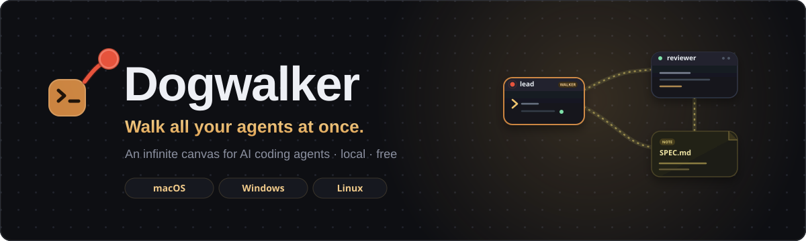

<div align="center">



An infinite canvas for AI coding agents: real terminals as nodes on a zoomable 2D surface. Put them on a leash — wire terminals together and your agents talk to each other through a structured protocol. Cross-platform. Local. Free.

*macOS · Windows · Linux — **v1.0** (Windows-verified; macOS/Linux QA pending)*

[Product](PRODUCT.md) · [Architecture](ARCHITECTURE.md) · [Agent guide](AGENTS.md) · [Design](DESIGN.md)

</div>

---

## Why

Running multiple AI coding agents today means a pile of terminal tabs: no spatial context, no way for agents to cooperate, no view of the whole operation. Existing "agent canvas" tools are single-platform and paid.

Dogwalker gives you one infinite canvas per project where every terminal is a live node. Zoom out and watch your team of agents work; zoom in and talk to one. Connect two terminals and their agents can message each other, review each other's code, and share notes — through a real request/response protocol (the asker gets the target's captured output back), not brittle screen scraping.

```
        ┌──────────┐    ask →     ┌──────────┐
        │  Claude   │◄────────────►│  Codex    │
        │  (Lead)   │              │  (Coder)  │
        └────┬─────┘              └────┬─────┘
             │ reads/writes            │ check
        ┌────▼─────┐              ┌────▼─────┐
        │ SPEC.md   │              │ dev server│
        │ (note)    │              │ (terminal)│
        └──────────┘              └──────────┘
```

## Features

- **Infinite canvas** — Figma-style pan/zoom, groups, snapping, align/tidy, minimap.
- **Real terminals** — actual PTYs with GPU-accelerated rendering, 1–9 quick-jump, themes, per-terminal memory limits. Terminals stay visibly alive at every zoom level.
- **Agents as launch configs** — an agent is just a command auto-run in a terminal. Ships with presets for Claude Code, Codex, Gemini CLI, OpenCode and aider (plus a plain shell); add, edit and duplicate any local command you want.
- **Inter-agent messaging** — wire terminals and agents use the `dogwalker` CLI (alias: `walk`) to `ask` each other; the asker gets back whatever the target produced (no cooperation or reply command needed). Click any leash to see the full message history.
- **`check` anything** — agents can read the live screen of *any* connected terminal: another agent, a build, a dev server, a log tail.
- **Walker mode** — promote an agent to manager: it recruits, wires, re-roles, and dismisses its own team via CLI.
- **Notes** — markdown files on disk rendered as sticky notes; agents read and edit connected notes; chain notes into mind-maps.
- **Prompt Composer** — floating rich-text input with @-mentions of terminals/notes/portals and image paste (delivered to agents as file paths — works with every major agent CLI).
- **File Tree** — embedded file manager with list/grid/git-diff/git-graph views, drag-to-agent, and a built-in code editor.
- **Portals** — isolated embedded browsers agents can drive: navigate, click, type, screenshot, run JS, read DOM and console. Link portals to share sessions.
- **Floors** — parallel isolated copies of your repo via git worktrees, each with its own canvas layer and terminals; "Land" merges back when done. Setup/teardown hooks included.
- **Routines** — scheduled prompts (single or `&&`-chained) on any agent, for recurring tests, health checks, review sweeps.
- **Workspaces** — per-project canvases with saved layouts, background operation, and one-click hibernation.

## Install

> **Release candidate (v0.8).** Feature-complete; cross-OS QA verified on Windows, macOS/Linux pending (see [Compatibility](#compatibility)).

### From a packaged build (recommended)

Grab the installer for your OS from the [latest release](https://github.com/caribeedu/dogwalker/releases/latest):

| OS | Artifact |
|---|---|
| Windows 10/11 | `Dogwalker-<version>.Setup.exe` |
| macOS 13+ | `Dogwalker-<version>.dmg` |
| Linux | `Dogwalker-<version>.AppImage`, or the `.deb` / `.rpm` |

Unsigned for now: Windows SmartScreen ("More info → Run anyway") and macOS Gatekeeper (right-click → Open, or `xattr -dr com.apple.quarantine Dogwalker.app`) will warn on first launch. Code signing + notarization are tracked for a later release.

**Requirement:** `git` on your PATH (for Floors and the git views).

### From source

**Requirements:** Node.js 20+, git.

```bash
git clone https://github.com/caribeedu/dogwalker
cd dogwalker
npm install
npm start
```

Build your own installers with `npm run make` (produces your current OS's artifact under `out/make/`).

## Quick start

1. **Create a workspace** — point it at a project directory.
2. **Draw a terminal** — pick the Terminal tool, drag a rectangle, choose an agent preset (or a plain shell).
3. **Draw a second terminal**, then **connect them** — select one, press the connection shortcut, click the other.
4. **Ask across the wire** — in terminal A's agent, type: *"use dogwalker to ask Reviewer to look at auth.ts"*. The agent runs `dogwalker ask reviewer "…"`; Dogwalker delivers the message, waits for the reviewer to finish, and hands its output straight back to A — the reviewer just responds normally, no reply command needed.
5. **Watch** — zoom out; attention dots light up when an agent finishes and waits for you.

## Compatibility

### AI agents

Any tool launchable as a command works — an agent is just a command in a terminal. Shipped presets:

| Agent | Messaging (`ask`) | Images via composer | Notes/Portals via CLI |
|---|---|---|---|
| Claude Code | ✅ | ✅ (file path) | ✅ |
| Codex CLI | ✅ | ✅ (file path) | ✅ |
| Gemini CLI | ✅ | ✅ (file path) | ✅ |
| Any script / plain shell | Connected AI agents can watch this terminal's live screen via `check` (builds, dev servers, log tails); the script itself can also call the CLI | — | ✅ |

Agents learn the CLI through a skill installed in your agent-skills folder — no per-vendor integration, no MCP configuration.

### Platforms & terminals

| | macOS 13+ | Windows 10/11 | Linux |
|---|---|---|---|
| PTY backend | node-pty (forkpty) | node-pty (ConPTY) | node-pty (forkpty) |
| Shells | zsh, bash, fish | PowerShell, WSL | bash, zsh, fish |
| GPU terminal rendering | ✅ | ✅ | ✅ |
| Floors (git worktree) | ✅ | ✅ | ✅ |
| QA verified (through v0.7) | pending | ✅ | pending |

> **Known limitation (v0.7 beta):** the full feature matrix has been exercised on **Windows** so far. macOS and Linux (X11/Wayland) are supported by design — no OS-specific hacks — but their QA passes are still pending; see [ARCHITECTURE.md §8/§14](ARCHITECTURE.md). The cross-OS matrix is the one v0.7 exit criterion open by environment.

## Architecture at a glance

Electron app, two halves: a **host daemon** (main process) owning PTYs, the IPC socket, the message broker, portals (CDP), floors, and routines — and a **canvas UI** (renderer) built on React Flow with xterm.js terminal nodes. The `dogwalker` CLI available inside canvas terminals is a thin shim over the daemon's socket; **all** agent-facing capability flows through one broker, gated by the connection graph.

Highlights worth reading about:

- [Terminal rendering degradation ladder](ARCHITECTURE.md#4-terminal-rendering-the-degradation-ladder) — how dozens of live terminals stay smooth on a zoomable canvas.
- [The ask protocol](ARCHITECTURE.md#5-the-ipc-bus--dogwalker-cli) — structured messaging via captured output, with atomic bracketed-paste injection.
- [Attention detection](ARCHITECTURE.md#6-attention-detection) — OSC 133 shell integration instead of vendor heuristics.
- [Floors on git worktrees](ARCHITECTURE.md#8-floors-git-worktrees) — cross-platform parallel workspaces.

Full docs: [PRODUCT.md](PRODUCT.md) (what & why) · [ARCHITECTURE.md](ARCHITECTURE.md) (how) · [AGENTS.md](AGENTS.md) (for AI agents working on this codebase).

## Privacy

Everything runs locally. No accounts, no telemetry, no cloud services. Notes are plain markdown on your disk; workspace layouts are plain JSON.

## License

Free and open source. License file to be added (MIT intended).

## Status & roadmap

The full path — expectations, outputs, and exit criteria per version — is in [ROADMAP.md](ROADMAP.md):

- [x] **v0.0.1 — Alpha**: spike — 15 live agent terminals on a React Flow canvas with renderer hot-swap (validates the stack) ✓ *passed 2026-07-19*
- [x] **v0.1 — Core loop**: broker + `dogwalker` CLI (`ask`/`check`/`note`) + agent skill, connections, workspace persistence, app shell, notes, prompt composer, terminal themes, attention
- [x] **v0.2 — Daily-driver comfort**: canvas completion, workspace shell, themes, memory limits
- [x] **v0.3 — File Tree & visual context**: list/diff/graph views, git ops, embedded editor, search, note images
- [x] **v0.4 — Portals**: embedded automatable browsers + `portal` CLI verbs
- [x] **v0.5 — Floors**: parallel git-worktree workspaces with Land flow and hooks
- [x] **v0.6 — Automation**: Routines + Walker mode
- [x] **v0.7 — Hardening**: failure recovery, doc-sync, invariant audit *(cross-OS QA: Windows verified, macOS/Linux pending)*
- [x] **v0.8 — Release engineering**: per-OS installers, versioned skill, GitHub Actions CI
- [x] **v1.0 — Launch**: parity audit, changelog, tagged release *(open exit criteria: macOS/Linux fresh-install QA + signing)*

Contributions and issue reports welcome — see [CONTRIBUTING.md](CONTRIBUTING.md). Bugs/ideas go through the [issue templates](.github/ISSUE_TEMPLATE); the honest status is in [PARITY.md](PARITY.md).
